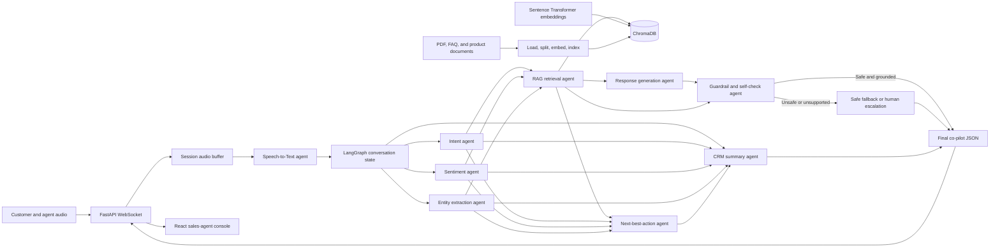
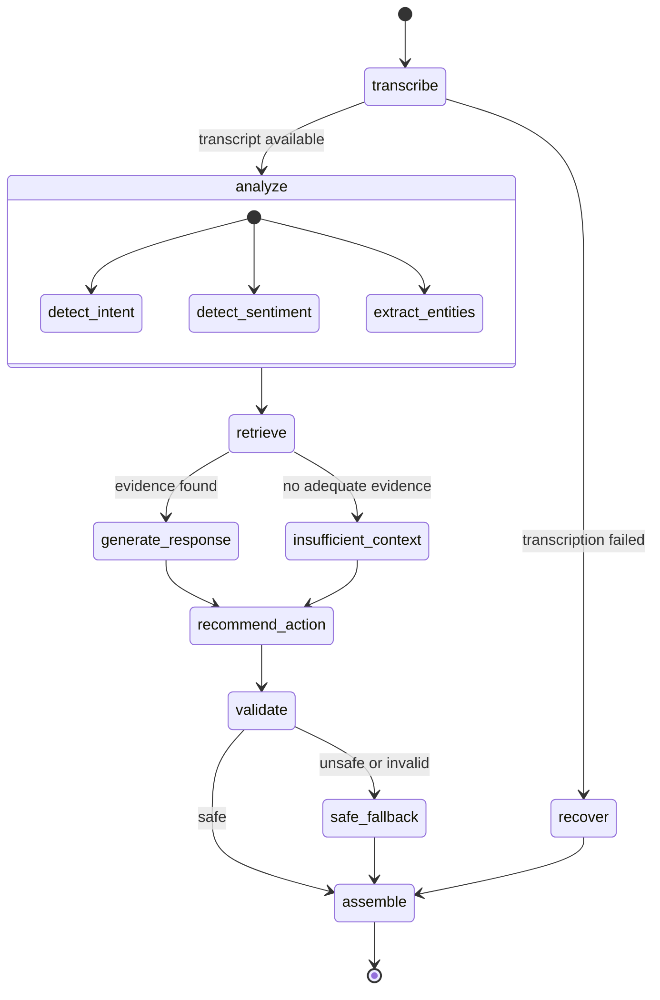

# Pay-in-3 AI Voice Sales Co-Pilot

A modular, real-time AI assistant for inside-sales representatives discussing a
fintech Pay-in-3 product. The system listens to a call, derives customer signals,
retrieves approved product knowledge, recommends a grounded response and next
action, and prepares a structured CRM update.

The co-pilot assists a human sales representative. It does not make credit
decisions, approve applications, provide personalized financial advice, or speak
directly to the customer.

## Core design principles

- One responsibility per agent; there is no monolithic prompt.
- Pydantic models define every boundary between agents.
- LangGraph controls execution, retries, conditional routing, and final assembly.
- Retrieval precedes response generation, and every factual response requires
  source evidence.
- Guardrails run before suggestions are delivered to the sales representative.
- Model, vector-store, and transcription implementations are injected behind
  interfaces so they can be replaced independently.
- Partial failures are represented explicitly rather than silently producing
  incomplete or invented results.
- Logs use identifiers and operational metadata, not raw audio or sensitive
  customer fields.

## Architecture



## Runtime data flow

1. The React client opens a WebSocket session and streams bounded audio frames.
2. The audio service validates frame size and format, buffers a short utterance,
   and applies backpressure when transcription cannot keep up.
3. The Speech-to-Text agent sends the utterance to Whisper and appends a
   timestamped transcript segment to the conversation state.
4. Intent, sentiment, and entity agents analyze the latest customer utterance.
   These independent nodes may execute concurrently.
5. The RAG agent constructs a retrieval query from the utterance and detected
   intent, embeds it, and retrieves approved chunks from ChromaDB.
6. The Response agent receives only the transcript, typed analysis, and retrieved
   chunks. It must cite chunk identifiers for every product claim. If evidence is
   insufficient, it returns a safe clarification or escalation response.
7. The Next Best Action agent selects an action from a controlled enum. It cannot
   execute external side effects such as sending a brochure or creating an
   application; it only recommends the action.
8. The Guardrail agent validates schema conformance, evidence citations,
   unsupported financial claims, and restricted language. Invalid suggestions are
   replaced with a safe fallback and a human-review flag.
9. The graph assembles the validated outputs and sends a structured JSON event to
   the sales console.
10. When the call ends, the CRM agent summarizes the complete transcript and
    generates typed CRM fields, persists the summary and lead state, and creates
    a linked follow-up and task when the next action requires one.

## Agents

### Speech-to-Text agent

Accepts validated audio bytes and produces transcript segments with timestamps,
language, and confidence metadata. Whisper inference is isolated in a model
adapter. Streaming is implemented as short-window incremental transcription
rather than assuming Whisper itself is token-streaming.

### Intent detection agent

Classifies the latest customer intent into a controlled taxonomy:

- Product Inquiry
- Eligibility
- Pricing
- KYC
- Objection
- Existing Loan
- Interested
- Follow Up
- Rejection
- Unknown

The `Unknown` value prevents forced classification when evidence is weak.

### Sentiment agent

Classifies the customer's current emotion as positive, neutral, negative,
frustrated, confused, or unknown. The output includes confidence and a short
evidence excerpt. Sentiment informs tone and escalation but never eligibility.

### Entity extraction agent

Extracts salary, age, city, occupation, requested loan amount, employment type,
and customer name. Every field is optional because the system distinguishes
missing information from zero or an empty string. Financial values retain their
currency and source text; normalization never invents a currency.

### RAG retrieval agent

Loads approved PDFs, FAQ JSON, Markdown, and text product documents. It attaches
source metadata, splits documents into overlapping chunks, creates local Sentence
Transformer embeddings, and persists them in ChromaDB. Retrieval outputs include
the chunk text, source, page, score, and stable chunk identifier required for
grounding checks.

### Response generation agent

Uses Gemini structured output to recommend a concise response for the human
representative. Product claims must cite retrieved chunk identifiers. The agent
is explicitly allowed to say the knowledge base does not contain enough
information; it may not fill gaps from model memory.

### Next Best Action agent

Recommends one controlled action:

- Explain Benefits
- Explain KYC
- Schedule Follow-up
- Transfer to Human Expert
- Send Product Brochure
- Start Application
- Address Objection
- Ask Clarifying Question
- No Action

The action includes rationale and confidence. Execution remains under human or
downstream-system control.

### CRM summary agent

Runs on call completion and generates a call summary, lead score, optional
follow-up date, primary concern, lead status, and important notes. The lead score
uses deterministic, auditable rules informed by structured agent outputs; the LLM
does not freely invent the numeric score.

### Guardrail and self-check agent

Checks that output is valid against the response schema, cited claims exist in
retrieved context, and the suggestion contains no unsupported financial advice,
guarantees, fabricated pricing, or approval promises. It returns violations,
grounding coverage, a safe/unsafe verdict, and whether human review is required.

## LangGraph workflow



Post-call CRM summarization is invoked when the session receives a `call_end`
event. It reuses the accumulated graph state but is not placed on the latency-
critical path for every utterance.

## Final output contract

The external JSON response is versioned and contains agent-level confidence and
traceable retrieval evidence:

```json
{
  "schema_version": "1.0",
  "session_id": "5ca5a3e9-7558-4616-8f35-1da845b534a3",
  "intent": "eligibility",
  "sentiment": "neutral",
  "entities": {
    "salary": {"amount": 60000, "currency": "INR"},
    "city": "Bengaluru"
  },
  "retrieved_context": [
    {
      "chunk_id": "eligibility.pdf:2:8b61f4",
      "text": "Example approved knowledge-base excerpt.",
      "source": "eligibility.pdf",
      "page": 2,
      "relevance_score": 0.91
    }
  ],
  "suggested_response": {
    "text": "Example grounded suggestion for the sales representative.",
    "citations": ["eligibility.pdf:2:8b61f4"]
  },
  "next_best_action": "ask_clarifying_question",
  "crm_summary": null,
  "guardrail": {
    "is_safe": true,
    "is_grounded": true,
    "requires_human_review": false,
    "violations": []
  },
  "confidence": 0.91
}
```

`retrieved_context` is an array rather than a single string so the system retains
source attribution. A CRM summary is `null` during the live call and populated on
the final call event.

## Planned project layout

```text
ai/
├── agents/       # Isolated domain agents and agent-specific collaborators
├── api/          # FastAPI HTTP and WebSocket transport
├── config/       # Environment settings, logging, and dependency composition
├── models/       # Gemini, embedding, and Whisper provider adapters
├── orchestrator/ # LangGraph state, nodes, routing, and compiled workflow
├── prompts/      # Small version-controlled prompts, one concern per module
├── schemas/      # Pydantic boundary and domain models
├── services/     # Stateful audio, session, document, and vector-store services
├── utils/        # Dependency-free shared utilities
└── main.py       # FastAPI application factory and process entry point
```

Tests mirror production boundaries under `tests/unit` and `tests/integration`.
Runtime knowledge is mounted under `data/documents`; local Chroma persistence is
stored under `data/chroma` and excluded from version control.

## Configuration

All secrets and deployment-specific settings are supplied through environment
variables. The eventual `.env.example` will document the complete set, including:

```dotenv
APP_ENV=development
LOG_LEVEL=INFO
GEMINI_API_KEY=replace-me
GEMINI_MODEL=gemini-flash-lite-latest
WHISPER_MODEL=base
EMBEDDING_MODEL=sentence-transformers/all-MiniLM-L6-v2
CHROMA_PERSIST_DIRECTORY=./data/chroma
CHROMA_COLLECTION=pay_in_3_knowledge
RAG_TOP_K=5
RAG_MIN_RELEVANCE_SCORE=0.48
```

Secrets must not be committed or written to logs. Production deployments should
use a secrets manager and explicit allowed origins rather than permissive CORS.

## Local development

Install the existing services and frontend without changing their architecture:

```bash
python -m venv .venv
python -m pip install --upgrade pip
python -m pip install -r requirements.txt
cp .env.example .env
cd frontend && npm install && cd ..
cd backend && alembic upgrade head && cd ..
```

Windows PowerShell equivalent for the environment file:

```powershell
Copy-Item .env.example .env
```

Run quality checks with:

```bash
ruff check ai tests
ruff format --check ai tests
mypy ai
pytest
```

Run the complete local demo in three PowerShell terminals after copying
`.env.example` to `.env` and `frontend/.env.example` to `frontend/.env.local`:

```powershell
# Terminal 1: SQLAlchemy core API
Set-Location backend
..\.venv\Scripts\python.exe -m alembic upgrade head
..\.venv\Scripts\python.exe -m uvicorn app.main:app --host 127.0.0.1 --port 8000 --reload

# Terminal 2: AI/LangGraph/Whisper/Chroma service
.\.venv\Scripts\python.exe -m uvicorn ai.main:create_app --factory --host 127.0.0.1 --port 8001 --reload

# Terminal 3: sales-agent UI
Set-Location frontend
npm run dev
```

For a login-enforced demo, set `AUTH_REQUIRED=true`, configure the same strong
`JWT_SECRET` in the core and AI environments, create an authorized agent, and
then start the services:

```powershell
Set-Location backend
..\.venv\Scripts\python.exe scripts\create_user.py --email agent@example.com --name "Demo Agent" --role agent
```

The script prompts for a password and stores only its PBKDF2 hash. Development
mode may leave `AUTH_REQUIRED=false`; consent is still mandatory before the
microphone control is enabled.

## Security and compliance boundaries

- Do not treat extracted entities as verified customer information.
- Do not log raw audio, full transcripts, API keys, or unnecessary PII.
- Encrypt transport in production and define retention and deletion policies.
- Require representative confirmation before CRM writes or customer-facing
  actions.
- Do not claim guaranteed approval, guaranteed savings, or undisclosed pricing.
- Do not infer protected attributes or use emotion to make credit decisions.
- Retrieve only approved, versioned product and compliance documents.
- Escalate when context is missing, contradictory, stale, or below the retrieval
  threshold.

## License

Proprietary. Replace this section with the hackathon team's chosen license before
public distribution.
